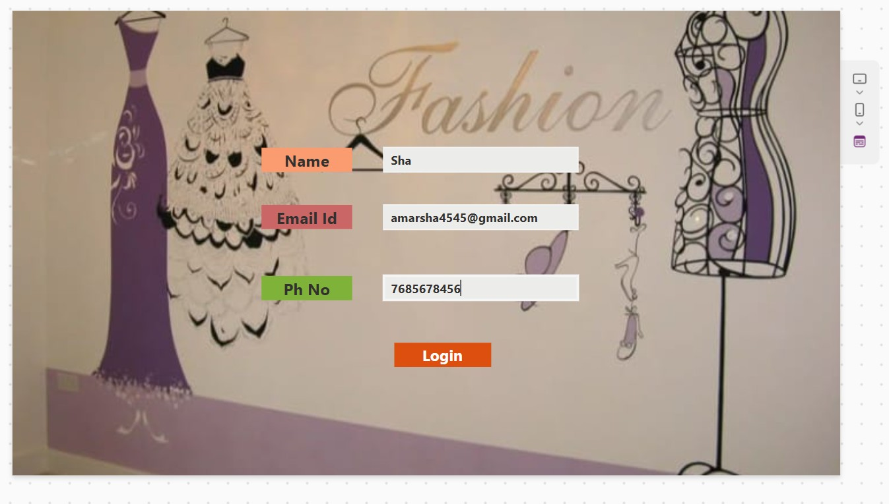
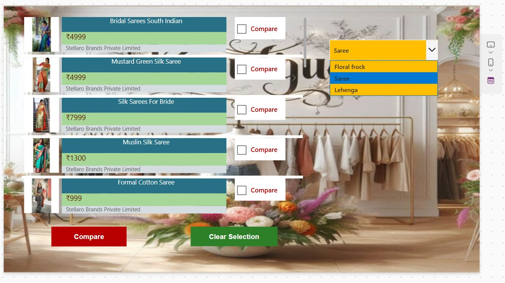
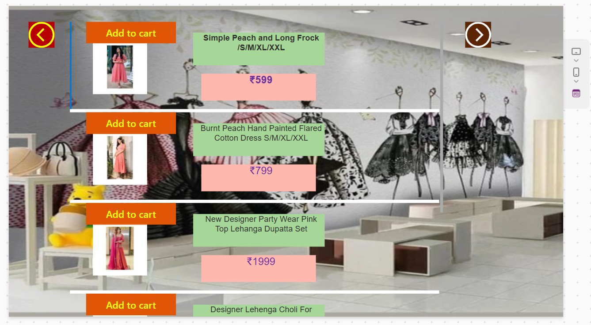
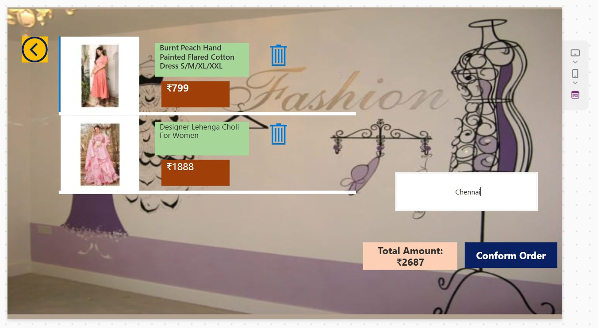
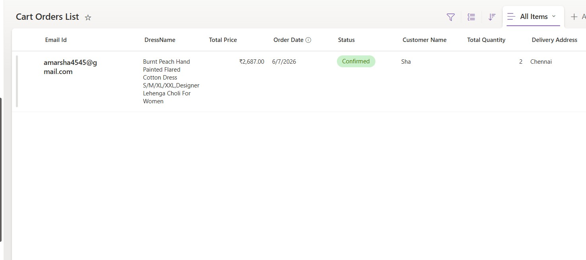
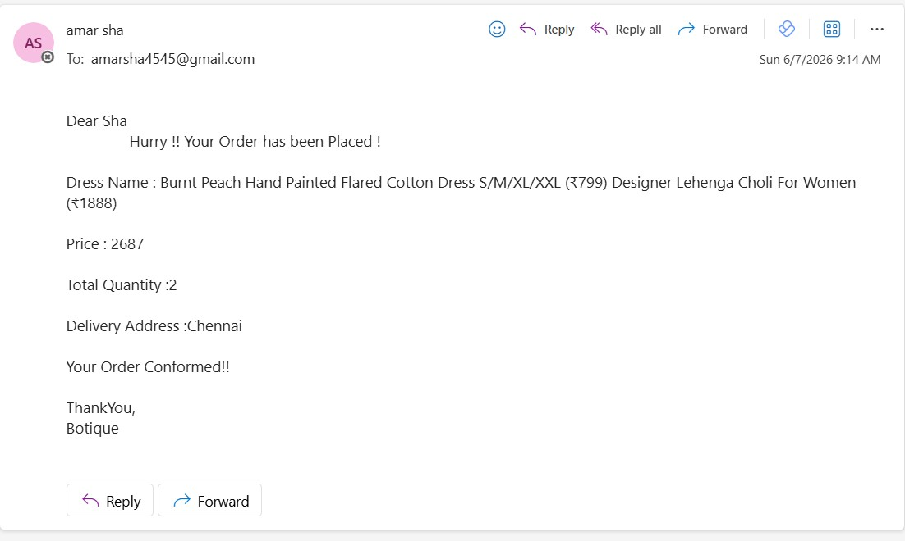

# Fashion-Boutique-App-

A Fashion Boutique App built using Power Apps with SharePoint as a data source and automated workflows using Power Automate.

The Fashion Boutique App is a Power Apps-based application designed to provide a seamless and user-friendly clothing exploring and shopping experience. Users can browse ethnic wear items, filter categories, compare different dresses, add items to their cart, and place orders efficiently.

This application uses SharePoint as the backend data source and Power Automate for workflow automation, enabling smooth order processing, database entry, and real-time email tracking.

## Features

* **User Login Registration** using Patch and LookUp functions to capture basic user information.
* **Dynamic Menu Display** using Gallery and Filter functions to change categories (Saree, Lehenga, Floral Frock).
* **Item Comparison Matrix** allowing users to select and cross-check multiple items side-by-side.
* **Add/Remove items to cart** seamlessly managed dynamically using Power Apps Collections.
* **Order placement and management** with automatic location capture and final price calculation.
* **Real-time order confirmation** automated using custom Power Automate cloud flows.
* **Data storage and management** securely handled using structured SharePoint lists.

##  Technologies Used

* **Microsoft Power Apps** (Canvas App)
* **Power Automate** (Cloud Workflows)
* **SharePoint** (Backend Data Source)
* **Collections & Global Variables** (State Management)

## Key Highlights

* User-friendly, highly tailored, and interactive boutique UI.
* Efficient data management and fast item lookups using optimized SharePoint indexing.
* Automated workflow for instant order receipt processing.
* Real-time automated email generation sent to customers directly upon checkout.
* Scalable solution for small-to-medium scale retail business configurations.

## Installation & Setup Guide

### 1. SharePoint Backend Setup
1. Create a SharePoint List named **`Cart Orders List`**.
2. Add columns: `Email Id`, `DressName`, `Total Price`, `Order Date`, `Status`, `Customer Name`, `Total Quantity`, `Delivery Address`.

### 2. Import Power App
1. Go to make.powerapps.com -> Apps -> Import canvas app.
2. Upload the package and reconnect the data source to your SharePoint list.

---

## 📸 Screenshots

### 1. Login Screen

### 2. Product Catalog & Category Filter

### 3. Product Details & Cart Management

### 4. Checkout & Order Confirmation Screen

### 5. Backend SharePoint Data List

### 6. Automated Email Notification Received

